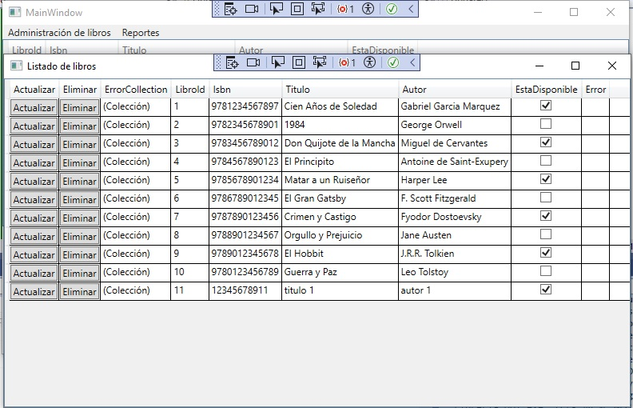
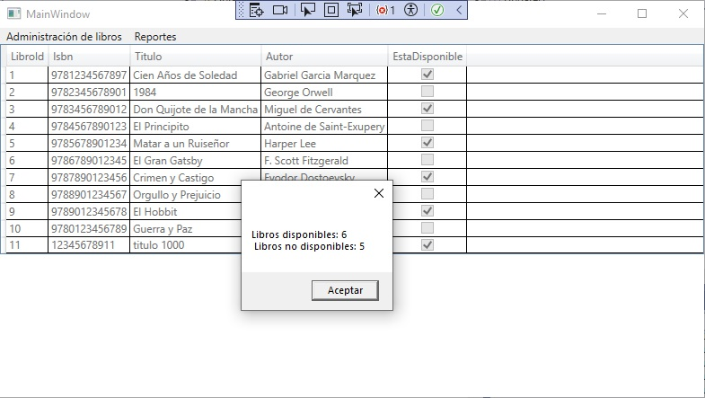

# Librería WPF

Este proyecto es una aplicación de escritorio para la gestión de una librería. Permite agregar, listar, actualizar y eliminar libros utilizando una interfaz de usuario desarrollada con WPF y conectada a una base de datos SQL Server utilizando Entity Framework.

## Características

- Agregar nuevos libros a la colección.
- Listar todos los libros disponibles.
- Actualizar la información de los libros.
- Eliminar libros de la colección.
- Consultar reportes de libros disponibles y no disponibles.

## Tecnologías Utilizadas

- **C#**
- **WPF (Windows Presentation Foundation)**
- **Entity Framework 6.5.1**
- **SQL Server**
- **.NET 8.0**

## Requisitos

- .NET 8.0 SDK
- Visual Studio 2022
- SQL Server

## Uso

### Agregar Libros
1. Navega a la sección de agregar libros.
2. Completa los campos necesarios: ISBN, Título, Autor, Disponibilidad.
3. Haz clic en el botón "Guardar".

### Listar Libros
1. Navega a la sección de listar libros.
2. Visualiza la lista de todos los libros disponibles en la base de datos.

### Actualizar Libros
1. Desde la lista de libros, selecciona el libro que deseas actualizar.
2. Modifica los campos necesarios.
3. Haz clic en el botón "Actualizar".

### Eliminar Libros
1. Desde la lista de libros, selecciona el libro que deseas eliminar.
2. Haz clic en el botón "Eliminar".

### Reportes
1. Navega a la sección de reportes.
2. Selecciona el reporte de libros disponibles o no disponibles.

## Futuras Mejoras

- Conectar la aplicación a una base de datos en la nube.
- Agregar autenticación y autorización de usuarios.
- Implementar pruebas unitarias para la lógica de negocio.

## Contribuciones

Las contribuciones son bienvenidas. Por favor, crea un fork del repositorio y abre un pull request con tus cambios.

## Licencia

Este proyecto está bajo la Licencia MIT. Para más detalles, consulta el archivo [LICENSE](LICENSE).
